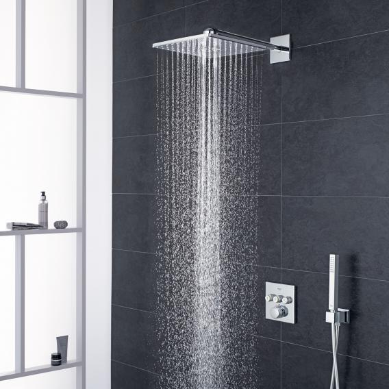
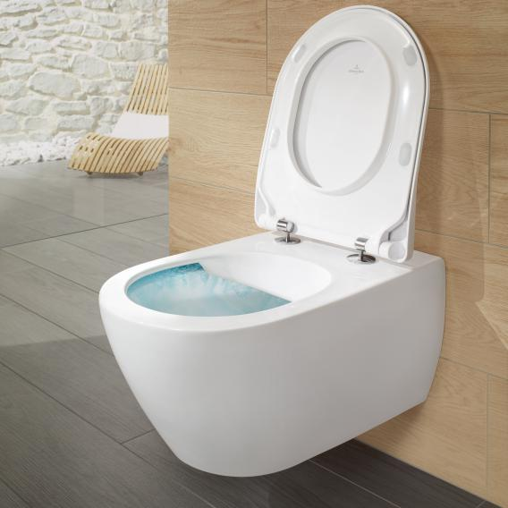
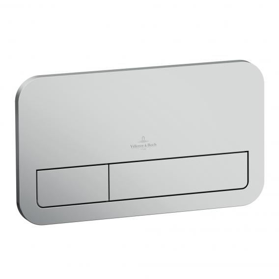
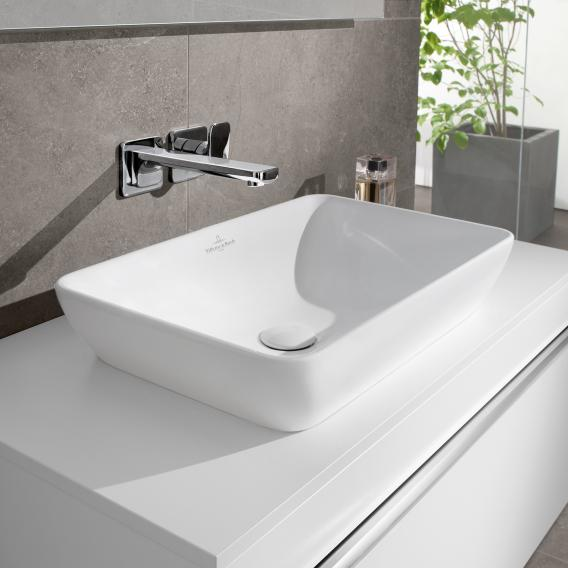
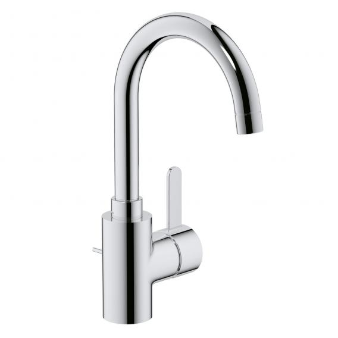
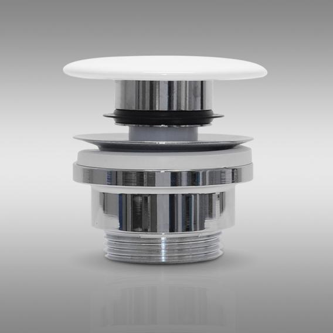
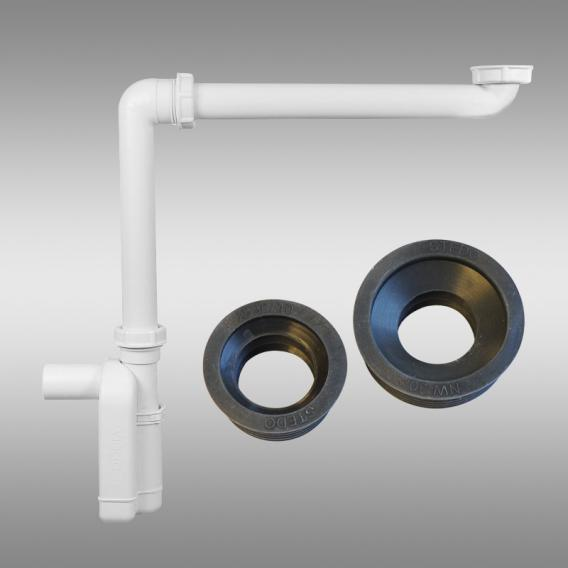
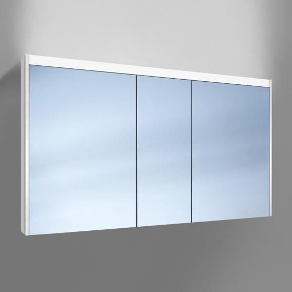

# Sanitary Ware

## Ensuite

### Shower

| Product Name                           | Item Number    | Price          | Retailer       | Datasheet      |
| ---------------------------------------| -------------- | -------------- | -------------- | -------------- |
| Grohe Grohtherm SmartControl shower system with thermostat & Rainshower 310 SmartActive Cube overhead shower | [34706000](https://www.grohe.co.uk/en_gb/grohtherm-smartcontrol-perfect-shower-set-with-rainshower-smartactive-310-cube-34706000.html) | [€827.89](https://www.reuter.com/grohe-grohtherm-smartcontrol-shower-system-with-thermostat-rainshower-310-smartactive-cube-overhead-shower-a628231.php) | Reuter (Germany) | <a href="https://raw.githubusercontent.com/pirateZilla/Sanitary-Ware/main/Ensuite-Shower-System.pdf?token=AEUD2R6JVWD7D4RX6XWN3L3BC65VE" target="_blank">Datasheet</a> |

#### Additional Technical Specifications and Manuals

* Item 1
* Item 2
* Item 3

### Toilet

| Product Name                           | Item Number    | Price          | Retailer       | Datasheet      |
| ---------------------------------------| -------------- | -------------- | -------------- | -------------- |
| Villeroy & Boch Subway 2.0 & ViConnect NEW complete set wall-mounted washdown toilet, with toilet seat rimless, white, with CeramicPlus | [5614R0R1+9M78S101+92246100](https://pro.villeroy-boch.com/en/gb/bw/m/Subway-2.0-Washdown-toilet%2C-rimless-Oval-5614R0.html) | [€535.22](https://www.reuter.com/villeroy-boch-subway-20-viconnect-complete-set-wall-mounted-washdown-toilet-l-56-w-37-cm-with-toilet-seat-rimless-white-with-ceramicplus-a747937.php) | Reuter (Germany) | <a href="https://raw.githubusercontent.com/pirateZilla/Sanitary-Ware/main/Wall-Hung-Toilet.pdf?token=AEUD2R6RDMXKMVQGYTPCBSDBC7ANY" target="_blank">Datasheet</a> |
| Villeroy & Boch ViConnect E200 flush plate matt chrome | [92249069](https://pro.villeroy-boch.com/en/se/bathroom-and-wellness/product-detail/m/922490.html?tx_mmpdu_profiportal%5Baction%5D=detail&cHash=17459d3a6ebc10416726af7365e6d787) | [€60.01](https://www.reuter.com/villeroy-boch-viconnect-e200-flush-plate-matt-chrome-a536162.php) | Reuter (Germany) | <a href="https://raw.githubusercontent.com/pirateZilla/Sanitary-Ware/main/Flush%20Plate.pdf?token=AEUD2R7D3NHUJY5BKGQK76DBC7AS2" target="_blank">Datasheet</a> |

#### Additional Technical Specifications and Manuals

* <a href="https://raw.githubusercontent.com/pirateZilla/Sanitary-Ware/main/Wall-Hung-Toilet.pdf?token=AEUD2R6RDMXKMVQGYTPCBSDBC7ANY" target="_blank">Wall Hung Toilet System Datasheet</a>
* <a href="https://raw.githubusercontent.com/pirateZilla/Sanitary-Ware/main/Toilet-Ceramic-Bowl.pdf?token=AEUD2RYLWWYVKU4VXP7S2RLBC7ASY" target="_blank">Toilet Bowl Datasheet</a>
* <a href="https://raw.githubusercontent.com/pirateZilla/Sanitary-Ware/main/Toilet-Seat.pdf?token=AEUD2RYBDR3V7PZ5SYU5PQ3BC7ASW" target="_blank">Toilet Seat Datasheet</a>
* <a href="https://raw.githubusercontent.com/pirateZilla/Sanitary-Ware/main/Flush%20Plate.pdf?token=AEUD2R7D3NHUJY5BKGQK76DBC7AS2" target="_blank">Flushplate Datasheet</a>

### Sinks

| Product Name                           | Item Number    | Price          | Retailer       | Datasheet      | Quantity |
| ---------------------------------------| -------------- | -------------- | -------------- | -------------- | -------- |
| Villeroy & Boch Venticello semi-recessed countertop washbasin white, with CeramicPlus | [411355R1](https://pro.villeroy-boch.com/en/dk/bathroom-and-wellness/products/product-search/washbasins/m/411355.html?tx_mmpdu_profiportal%5Baction%5D=detail&cHash=8083e1b2b1b006fa62f1007564229a51) | [€254.45](https://www.reuter.com/villeroy-boch-venticello-semi-recessed-countertop-washbasin-w-55-h-10-d-36-cm-w-overflow-white-with-ceramicplus-a501004.php) | Reuter (Germany) | <a href="https://raw.githubusercontent.com/pirateZilla/Sanitary-Ware/main/Ensuite-Sinks.pdf" target="_blank">Datasheet</a> | 2 |
| Grohe Eurosmart Cosmopolitan single lever basin mixer, Zero, L size with pop-up waste set | [32830001](https://www.grohe.co.uk/en_gb/eurosmart-cosmopolitan-single-lever-basin-mixer-1-2-l-size-32830001.html) | [€95.61](https://www.reuter.com/grohe-eurosmart-cosmopolitan-single-lever-basin-mixer-zero-l-size-with-pop-up-waste-set-a734559.php) | Reuter (Germany) | <a href="https://raw.githubusercontent.com/pirateZilla/Sanitary-Ware/main/sink-tap.pdf" target="_blank">Datasheet</a> | 2 |
| PREMIUM Universal waste valve with accumulation function, with ceramic cap | [PR1004](https://www.reuter.com/premium-universal-waste-valve-with-accumulation-function-with-ceramic-cap-a698914.php) | [€52.64](https://www.reuter.com/premium-universal-waste-valve-with-accumulation-function-with-ceramic-cap-a698914.php) | Reuter (Germany) | <a href="https://raw.githubusercontent.com/pirateZilla/Sanitary-Ware/main/stoppers.pdf" target="_blank">Datasheet</a> | 2 |
| PREMIUM Universal compact siphon with siphon connection sleeves | [PR1007](https://www.reuter.com/premium-universal-compact-siphon-with-siphon-connection-sleeves-a800888.php) | [€66.44](https://www.reuter.com/premium-universal-compact-siphon-with-siphon-connection-sleeves-a800888.php) | Reuter (Germany) | <a href="https://raw.githubusercontent.com/pirateZilla/Sanitary-Ware/main/siphon.pdf" target="_blank">Datasheet</a> | 2 |

#### Additional Technical Specifications and Manuals

* Item 1
* Item 2
* Item 3

### Vanity Unit

| Product Name                           | Item Number    | Price          | Retailer       | Datasheet      |
| ---------------------------------------| -------------- | -------------- | -------------- | -------------- |
| Villeroy & Boch Venticello XXL vanity unit for 2 countertop basins with 4 pull-out compartments front matt black / corpus matt black, chrome handles | [A94401PD](https://pro.villeroy-boch.com/en/gb/bw/m/A94401.html?tx_mmpdu_profiportal%5Baction%5D=detail&cHash=e4d52a653b712e8116f6baa73fa0d2f3) | [€1,415.67](https://www.reuter.com/villeroy-boch-venticello-vanity-unit-xxl-for-2-countertop-washbasins-w-1257-h-606-d-502-cm-4-pull-out-compartments-front-matt-black-corpus-matt-black-chrome-handles-a569498.php) | Reuter (Germany) | <a href="https://raw.githubusercontent.com/pirateZilla/Sanitary-Ware/main/ensuite-vanity.pdf" target="_blank">Datasheet</a> |

#### Additional Technical Specifications and Manuals

* Item 1
* Item 2
* Item 3

### Mirror

| Product Name                           | Item Number    | Price          | Retailer       | Datasheet      |
| ---------------------------------------| -------------- | -------------- | -------------- | -------------- |
| Schneider O-Line wall-mounted or recessed mirror cabinet, 3 doors | [164.131.02.02](https://www.reuter.com/schneider-o-line-wall-mounted-or-recessed-mirror-cabinet-3-doors-w-130-h-745-d-128-cm-a599105.php) | [€913.18](https://www.reuter.com/schneider-o-line-wall-mounted-or-recessed-mirror-cabinet-3-doors-w-130-h-745-d-128-cm-a599105.php) | Reuter (Germany) | <a href="https://raw.githubusercontent.com/pirateZilla/Sanitary-Ware/main/ensuite-mirror.pdf" target="_blank">Datasheet</a> |

#### Additional Technical Specifications and Manuals

* Item 1
* Item 2
* Item 3

### Shower Drain

| Product Name                           | Item Number    | Price          | Retailer       | Datasheet      |
| ---------------------------------------| -------------- | -------------- | -------------- | -------------- |
| Product Name | [00000000](linktomanufacturer.com) | [€000.00](linktoretail.com) | Retailer | [Datasheet](rawpdf.com) |

#### Additional Technical Specifications and Manuals

* Item 1
* Item 2
* Item 3

### Radiator

| Product Name                           | Item Number    | Price          | Retailer       | Datasheet      |
| ---------------------------------------| -------------- | -------------- | -------------- | -------------- |
| Product Name | [00000000](linktomanufacturer.com) | [€000.00](linktoretail.com) | Retailer | [Datasheet](rawpdf.com) |

#### Additional Technical Specifications and Manuals

* Item 1
* Item 2
* Item 3

### Shower Glass

| Product Name                           | Item Number    | Price          | Retailer       | Datasheet      |
| ---------------------------------------| -------------- | -------------- | -------------- | -------------- |
| Product Name | [00000000](linktomanufacturer.com) | [€000.00](linktoretail.com) | Retailer | [Datasheet](rawpdf.com) |

#### Additional Technical Specifications and Manuals

* Item 1
* Item 2
* Item 3

## Main Bathroom

### Shower

| Product Name                           | Item Number    | Price          | Retailer       | Datasheet      |
| ---------------------------------------| -------------- | -------------- | -------------- | -------------- |
| Product Name | [00000000](linktomanufacturer.com) | [€000.00](linktoretail.com) | Retailer | [Datasheet](rawpdf.com) |

#### Additional Technical Specifications and Manuals

* Item 1
* Item 2
* Item 3

### Sink

| Product Name                           | Item Number    | Price          | Retailer       | Datasheet      |
| ---------------------------------------| -------------- | -------------- | -------------- | -------------- |
| Product Name | [00000000](linktomanufacturer.com) | [€000.00](linktoretail.com) | Retailer | [Datasheet](rawpdf.com) |

#### Additional Technical Specifications and Manuals

* Item 1
* Item 2
* Item 3

### Vanity Unit

| Product Name                           | Item Number    | Price          | Retailer       | Datasheet      |
| ---------------------------------------| -------------- | -------------- | -------------- | -------------- |
| Product Name | [00000000](linktomanufacturer.com) | [€000.00](linktoretail.com) | Retailer | [Datasheet](rawpdf.com) |

#### Additional Technical Specifications and Manuals

* Item 1
* Item 2
* Item 3

### Mirror

| Product Name                           | Item Number    | Price          | Retailer       | Datasheet      |
| ---------------------------------------| -------------- | -------------- | -------------- | -------------- |
| Product Name | [00000000](linktomanufacturer.com) | [€000.00](linktoretail.com) | Retailer | [Datasheet](rawpdf.com) |

#### Additional Technical Specifications and Manuals

* Item 1
* Item 2
* Item 3

### Toilet

| Product Name                           | Item Number    | Price          | Retailer       | Datasheet      |
| ---------------------------------------| -------------- | -------------- | -------------- | -------------- |
| Villeroy & Boch Subway 2.0 & ViConnect NEW complete set wall-mounted washdown toilet, with toilet seat rimless, white, with CeramicPlus | [5614R0R1+9M78S101+92246100](https://pro.villeroy-boch.com/en/gb/bw/m/Subway-2.0-Washdown-toilet%2C-rimless-Oval-5614R0.html) | [€535.22](https://www.reuter.com/villeroy-boch-subway-20-viconnect-complete-set-wall-mounted-washdown-toilet-l-56-w-37-cm-with-toilet-seat-rimless-white-with-ceramicplus-a747937.php) | Reuter (Germany) | <a href="https://raw.githubusercontent.com/pirateZilla/Sanitary-Ware/main/Wall-Hung-Toilet.pdf?token=AEUD2R6RDMXKMVQGYTPCBSDBC7ANY" target="_blank">Datasheet</a> |
| Villeroy & Boch ViConnect E200 flush plate matt chrome | [92249069](https://pro.villeroy-boch.com/en/se/bathroom-and-wellness/product-detail/m/922490.html?tx_mmpdu_profiportal%5Baction%5D=detail&cHash=17459d3a6ebc10416726af7365e6d787) | [€60.01](https://www.reuter.com/villeroy-boch-viconnect-e200-flush-plate-matt-chrome-a536162.php) | Reuter (Germany) | <a href="https://raw.githubusercontent.com/pirateZilla/Sanitary-Ware/main/Flush%20Plate.pdf?token=AEUD2R7D3NHUJY5BKGQK76DBC7AS2" target="_blank">Datasheet</a> |

#### Additional Technical Specifications and Manuals

* <a href="https://raw.githubusercontent.com/pirateZilla/Sanitary-Ware/main/Wall-Hung-Toilet.pdf?token=AEUD2R6RDMXKMVQGYTPCBSDBC7ANY" target="_blank">Wall Hung Toilet System Datasheet</a>
* <a href="https://raw.githubusercontent.com/pirateZilla/Sanitary-Ware/main/Toilet-Ceramic-Bowl.pdf?token=AEUD2RYLWWYVKU4VXP7S2RLBC7ASY" target="_blank">Toilet Bowl Datasheet</a>
* <a href="https://raw.githubusercontent.com/pirateZilla/Sanitary-Ware/main/Toilet-Seat.pdf?token=AEUD2RYBDR3V7PZ5SYU5PQ3BC7ASW" target="_blank">Toilet Seat Datasheet</a>
* <a href="https://raw.githubusercontent.com/pirateZilla/Sanitary-Ware/main/Flush%20Plate.pdf?token=AEUD2R7D3NHUJY5BKGQK76DBC7AS2" target="_blank">Flushplate Datasheet</a>

### Bath

## WC

### Toilet

| Product Name                           | Item Number    | Price          | Retailer       | Datasheet      |
| ---------------------------------------| -------------- | -------------- | -------------- | -------------- |
| Villeroy & Boch Subway 2.0 & ViConnect NEW complete set wall-mounted washdown toilet, with toilet seat rimless, white, with CeramicPlus | [5614R0R1+9M78S101+92246100](https://pro.villeroy-boch.com/en/gb/bw/m/Subway-2.0-Washdown-toilet%2C-rimless-Oval-5614R0.html) | [€535.22](https://www.reuter.com/villeroy-boch-subway-20-viconnect-complete-set-wall-mounted-washdown-toilet-l-56-w-37-cm-with-toilet-seat-rimless-white-with-ceramicplus-a747937.php) | Reuter (Germany) | <a href="https://raw.githubusercontent.com/pirateZilla/Sanitary-Ware/main/Wall-Hung-Toilet.pdf?token=AEUD2R6RDMXKMVQGYTPCBSDBC7ANY" target="_blank">Datasheet</a> |
| Villeroy & Boch ViConnect E200 flush plate matt chrome | [92249069](https://pro.villeroy-boch.com/en/se/bathroom-and-wellness/product-detail/m/922490.html?tx_mmpdu_profiportal%5Baction%5D=detail&cHash=17459d3a6ebc10416726af7365e6d787) | [€60.01](https://www.reuter.com/villeroy-boch-viconnect-e200-flush-plate-matt-chrome-a536162.php) | Reuter (Germany) | <a href="https://raw.githubusercontent.com/pirateZilla/Sanitary-Ware/main/Flush%20Plate.pdf?token=AEUD2R7D3NHUJY5BKGQK76DBC7AS2" target="_blank">Datasheet</a> |

#### Additional Technical Specifications and Manuals

* <a href="https://raw.githubusercontent.com/pirateZilla/Sanitary-Ware/main/Wall-Hung-Toilet.pdf?token=AEUD2R6RDMXKMVQGYTPCBSDBC7ANY" target="_blank">Wall Hung Toilet System Datasheet</a>
* <a href="https://raw.githubusercontent.com/pirateZilla/Sanitary-Ware/main/Toilet-Ceramic-Bowl.pdf?token=AEUD2RYLWWYVKU4VXP7S2RLBC7ASY" target="_blank">Toilet Bowl Datasheet</a>
* <a href="https://raw.githubusercontent.com/pirateZilla/Sanitary-Ware/main/Toilet-Seat.pdf?token=AEUD2RYBDR3V7PZ5SYU5PQ3BC7ASW" target="_blank">Toilet Seat Datasheet</a>
* <a href="https://raw.githubusercontent.com/pirateZilla/Sanitary-Ware/main/Flush%20Plate.pdf?token=AEUD2R7D3NHUJY5BKGQK76DBC7AS2" target="_blank">Flushplate Datasheet</a>

## Cost Table

| Product Name                           | Item Number    | Price          | Retailer       | Datasheet      |
| ---------------------------------------| -------------- | -------------- | -------------- | -------------- |
| Product Name | [00000000](linktomanufacturer.com) | [€000.00](linktoretail.com) | Retailer | [Datasheet](rawpdf.com) |