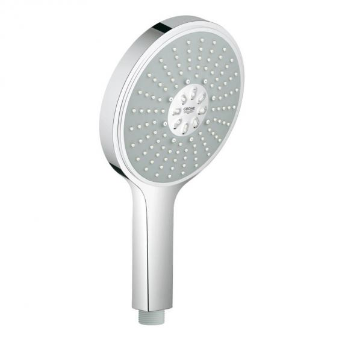
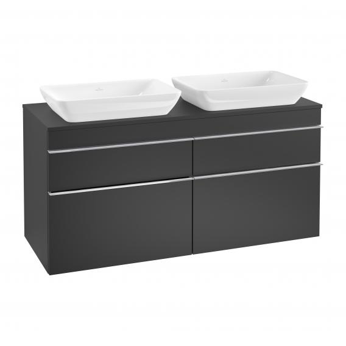
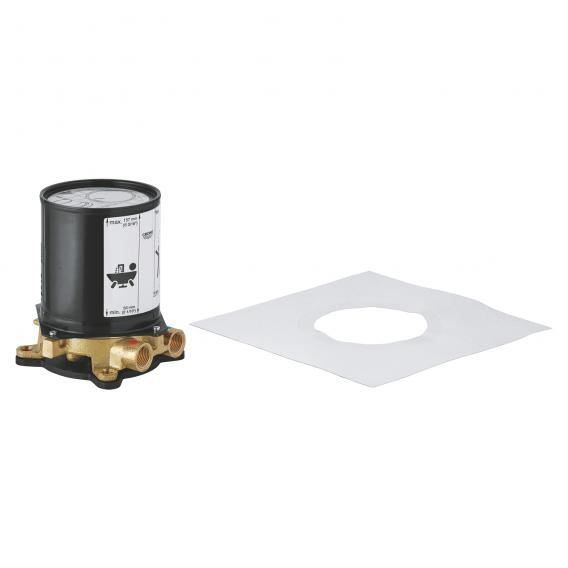
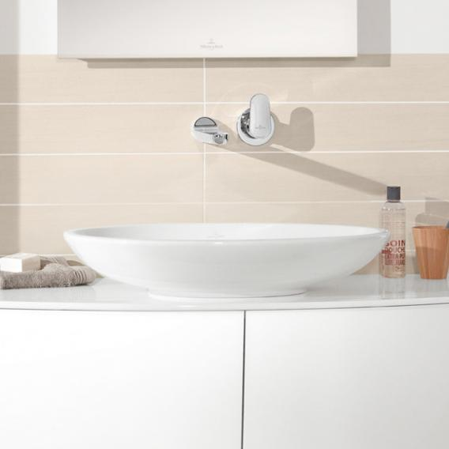

# Sanitary Ware

## Ensuite

### Shower

| Product Name                           | Item Number    | Price          | Retailer       | Datasheet      |
| ---------------------------------------| -------------- | -------------- | -------------- | -------------- |
| Grohe Grohtherm SmartControl shower system with thermostat & Rainshower 310 SmartActive Cube overhead shower | [34706000](https://www.grohe.co.uk/en_gb/grohtherm-smartcontrol-perfect-shower-set-with-rainshower-smartactive-310-cube-34706000.html) | [€827.89](https://www.reuter.com/grohe-grohtherm-smartcontrol-shower-system-with-thermostat-rainshower-310-smartactive-cube-overhead-shower-a628231.php) | Reuter (Germany) | <a href="https://raw.githubusercontent.com/pirateZilla/Sanitary-Ware/main/Ensuite-Shower-System.pdf?token=AEUD2R6JVWD7D4RX6XWN3L3BC65VE" target="_blank">Datasheet</a> |
| Grohe Power & Soul Cosmopolitan hand shower Ø 160 mm with flow rate function 9.4 l/min | [27668000](https://www.grohe.co.uk/en_gb/power-soul-cosmopolitan-160-hand-shower-4-sprays-27668000.html) | [€93.54](https://www.reuter.com/grohe-power-soul-cosmopolitan-hand-shower--160-mm-with-flow-rate-function-94-l-min-a377265.php) | Reuter (Germany) | <a href="https://raw.githubusercontent.com/pirateZilla/Sanitary-Ware/main/spare-head.pdf" target="_blank">Datasheet</a> |

#### Additional Technical Specifications and Manuals

* <a href="https://raw.githubusercontent.com/pirateZilla/Sanitary-Ware/main/ensuite-shower/1.pdf" target="_blank">Grohtherm SmartControl Technical Product Information 1</a>
* <a href="https://raw.githubusercontent.com/pirateZilla/Sanitary-Ware/main/ensuite-shower/2.pdf" target="_blank">Grohtherm SmartControl Technical Product Information 2</a>
* <a href="https://raw.githubusercontent.com/pirateZilla/Sanitary-Ware/main/ensuite-shower/3.pdf" target="_blank">Grohtherm SmartControl Technical Product Information 3</a>
* <a href="https://raw.githubusercontent.com/pirateZilla/Sanitary-Ware/main/ensuite-shower/4.pdf" target="_blank">Grohtherm SmartControl Technical Product Information 4</a>
* <a href="https://raw.githubusercontent.com/pirateZilla/Sanitary-Ware/main/ensuite-shower/5.pdf" target="_blank">Grohtherm SmartControl Technical Product Information 5</a>
* <a href="https://raw.githubusercontent.com/pirateZilla/Sanitary-Ware/main/ensuite-shower/6.pdf" target="_blank">Grohtherm SmartControl Technical Product Information 6</a>
* <a href="https://raw.githubusercontent.com/pirateZilla/Sanitary-Ware/main/ensuite-shower/7.pdf" target="_blank">Grohtherm SmartControl Technical Product Information 7</a>
* <a href="https://raw.githubusercontent.com/pirateZilla/Sanitary-Ware/main/ensuite-shower/1.jpg" target="_blank">Grohtherm SmartControl Technical Product Information 8</a>
* <a href="https://raw.githubusercontent.com/pirateZilla/Sanitary-Ware/main/ensuite-shower/2.jpg" target="_blank">Power & Soul Technical Product Information 1</a>
* <a href="https://raw.githubusercontent.com/pirateZilla/Sanitary-Ware/main/ensuite-shower/8.pdf" target="_blank">Power & Soul Technical Product Information 2</a>

### Toilet

| Product Name                           | Item Number    | Price          | Retailer       | Datasheet      |
| ---------------------------------------| -------------- | -------------- | -------------- | -------------- |
| Villeroy & Boch Subway 2.0 & ViConnect NEW complete set wall-mounted washdown toilet, with toilet seat rimless, white, with CeramicPlus | [5614R0R1+9M78S101+92246100](https://pro.villeroy-boch.com/en/gb/bw/m/Subway-2.0-Washdown-toilet%2C-rimless-Oval-5614R0.html) | [€535.22](https://www.reuter.com/villeroy-boch-subway-20-viconnect-complete-set-wall-mounted-washdown-toilet-l-56-w-37-cm-with-toilet-seat-rimless-white-with-ceramicplus-a747937.php) | Reuter (Germany) | <a href="https://raw.githubusercontent.com/pirateZilla/Sanitary-Ware/main/Wall-Hung-Toilet.pdf?token=AEUD2R6RDMXKMVQGYTPCBSDBC7ANY" target="_blank">Datasheet</a> |
| Villeroy & Boch ViConnect E200 flush plate matt chrome | [92249069](https://pro.villeroy-boch.com/en/se/bathroom-and-wellness/product-detail/m/922490.html?tx_mmpdu_profiportal%5Baction%5D=detail&cHash=17459d3a6ebc10416726af7365e6d787) | [€60.01](https://www.reuter.com/villeroy-boch-viconnect-e200-flush-plate-matt-chrome-a536162.php) | Reuter (Germany) | <a href="https://raw.githubusercontent.com/pirateZilla/Sanitary-Ware/main/Flush%20Plate.pdf?token=AEUD2R7D3NHUJY5BKGQK76DBC7AS2" target="_blank">Datasheet</a> |

#### Additional Technical Specifications and Manuals

* <a href="https://raw.githubusercontent.com/pirateZilla/Sanitary-Ware/main/Wall-Hung-Toilet.pdf?token=AEUD2R6RDMXKMVQGYTPCBSDBC7ANY" target="_blank">Wall Hung Toilet System Datasheet</a>
* <a href="https://raw.githubusercontent.com/pirateZilla/Sanitary-Ware/main/Toilet-Ceramic-Bowl.pdf?token=AEUD2RYLWWYVKU4VXP7S2RLBC7ASY" target="_blank">Toilet Bowl Datasheet</a>
* <a href="https://raw.githubusercontent.com/pirateZilla/Sanitary-Ware/main/Toilet-Seat.pdf?token=AEUD2RYBDR3V7PZ5SYU5PQ3BC7ASW" target="_blank">Toilet Seat Datasheet</a>
* <a href="https://raw.githubusercontent.com/pirateZilla/Sanitary-Ware/main/Flush%20Plate.pdf?token=AEUD2R7D3NHUJY5BKGQK76DBC7AS2" target="_blank">Flushplate Datasheet</a>

### Sinks

| Product Name                           | Item Number    | Price          | Retailer       | Datasheet      | Quantity |
| ---------------------------------------| -------------- | -------------- | -------------- | -------------- | -------- |
| Villeroy & Boch Venticello semi-recessed countertop washbasin white, with CeramicPlus | [411355R1](https://pro.villeroy-boch.com/en/dk/bathroom-and-wellness/products/product-search/washbasins/m/411355.html?tx_mmpdu_profiportal%5Baction%5D=detail&cHash=8083e1b2b1b006fa62f1007564229a51) | [€254.45](https://www.reuter.com/villeroy-boch-venticello-semi-recessed-countertop-washbasin-w-55-h-10-d-36-cm-w-overflow-white-with-ceramicplus-a501004.php) | Reuter (Germany) | <a href="https://raw.githubusercontent.com/pirateZilla/Sanitary-Ware/main/MB-ES-Sink.pdf" target="_blank">Datasheet</a> | 2 |
| Grohe Eurosmart Cosmopolitan single lever basin mixer, Zero, L size with pop-up waste set | [32830001](https://www.grohe.co.uk/en_gb/eurosmart-cosmopolitan-single-lever-basin-mixer-1-2-l-size-32830001.html) | [€95.61](https://www.reuter.com/grohe-eurosmart-cosmopolitan-single-lever-basin-mixer-zero-l-size-with-pop-up-waste-set-a734559.php) | Reuter (Germany) | <a href="https://raw.githubusercontent.com/pirateZilla/Sanitary-Ware/main/sink-tap.pdf" target="_blank">Datasheet</a> | 2 |
| PREMIUM Universal waste valve with accumulation function, with ceramic cap | [PR1004](https://www.reuter.com/premium-universal-waste-valve-with-accumulation-function-with-ceramic-cap-a698914.php) | [€52.64](https://www.reuter.com/premium-universal-waste-valve-with-accumulation-function-with-ceramic-cap-a698914.php) | Reuter (Germany) | <a href="https://raw.githubusercontent.com/pirateZilla/Sanitary-Ware/main/stoppers.pdf" target="_blank">Datasheet</a> | 2 |
| PREMIUM Universal compact siphon with siphon connection sleeves | [PR1007](https://www.reuter.com/premium-universal-compact-siphon-with-siphon-connection-sleeves-a800888.php) | [€66.44](https://www.reuter.com/premium-universal-compact-siphon-with-siphon-connection-sleeves-a800888.php) | Reuter (Germany) | <a href="https://raw.githubusercontent.com/pirateZilla/Sanitary-Ware/main/siphon.pdf" target="_blank">Datasheet</a> | 2 |

#### Additional Technical Specifications and Manuals

* Placeholder

### Vanity Unit

| Product Name                           | Item Number    | Price          | Retailer       | Datasheet      |
| ---------------------------------------| -------------- | -------------- | -------------- | -------------- |
| Villeroy & Boch Venticello XXL vanity unit for 2 countertop basins with 4 pull-out compartments front matt black / corpus matt black, chrome handles | [A94401PD](https://pro.villeroy-boch.com/en/gb/bw/m/A94401.html?tx_mmpdu_profiportal%5Baction%5D=detail&cHash=e4d52a653b712e8116f6baa73fa0d2f3) | [€1,415.67](https://www.reuter.com/villeroy-boch-venticello-vanity-unit-xxl-for-2-countertop-washbasins-w-1257-h-606-d-502-cm-4-pull-out-compartments-front-matt-black-corpus-matt-black-chrome-handles-a569498.php) | Reuter (Germany) | <a href="https://raw.githubusercontent.com/pirateZilla/Sanitary-Ware/main/ensuite-vanity.pdf" target="_blank">Datasheet</a> |

#### Additional Technical Specifications and Manuals

* Placeholder

### Mirror

| Product Name                           | Item Number    | Price          | Retailer       | Datasheet      |
| ---------------------------------------| -------------- | -------------- | -------------- | -------------- |
| Schneider O-Line wall-mounted or recessed mirror cabinet, 3 doors | [164.131.02.02](https://www.reuter.com/schneider-o-line-wall-mounted-or-recessed-mirror-cabinet-3-doors-w-130-h-745-d-128-cm-a599105.php) | [€913.18](https://www.reuter.com/schneider-o-line-wall-mounted-or-recessed-mirror-cabinet-3-doors-w-130-h-745-d-128-cm-a599105.php) | Reuter (Germany) | <a href="https://raw.githubusercontent.com/pirateZilla/Sanitary-Ware/main/ensuite-mirror.pdf" target="_blank">Datasheet</a> |

#### Additional Technical Specifications and Manuals

* Placeholder

### Shower Drain

| Product Name                           | Item Number    | Price          | Retailer       | Datasheet      |
| ---------------------------------------| -------------- | -------------- | -------------- | -------------- |
| TECE drainprofile shower channel set brushed stainless steel, L: 100 cm | [671000+673002](https://produktdaten.tece.de/web/tece_DE/lb/tece/KAT03TCDRAINPROFILEDUPRO/TECEdrainprofile%20Duschprofil%2C%201000%20mm%2C%20Edelstahl%20geb%C3%BCrstet/$catalogue/teceData/PR/671000/index.xhtml) | [€414.37](https://www.reuter.com/tece-drainprofile-shower-channel-set-dn-50-brushed-stainless-steel-l-100-cm-a692110.php) | Reuter (Germany) | <a href="https://raw.githubusercontent.com/pirateZilla/Sanitary-Ware/main/Shower-Drains.pdf" target="_blank">Datasheet</a> |
| OPTIONAL TECE drainprofile feet | [674000](https://produktdaten.tece.de/web/tece_DE/en_GB/tece/KAT03TCDRAINPROZUBEHOER/TECEdrainprofile%20mounting%20feet/PR/674000/index.xhtml) | [€20.39](https://www.reuter.com/tece-drainprofile-feet-a633882.php) | Reuter (Germany) | <a href="https://raw.githubusercontent.com/pirateZilla/Sanitary-Ware/main/drain-feet.pdf" target="_blank">Datasheet</a> |
| OPTIONAL TECE sound insulation mat Drainbase for TECE drainline, drainprofile and TECE drainboard | [660001](https://produktdaten.tece.de/web/tece_DE/lb/tece/KAT03TCDLZUBEHOER/TECE%20Drainbase%20sound%20insulation%20mat%20for%20Drainline%20and%20Drainboard%20-%20pcs./$catalogue/teceData/PR/660001/index.xhtml) | [€68.41](https://www.reuter.com/tece-sound-insulation-mat-drainbase-for-tece-drainline-drainprofile-and-tece-drainboard-a283167.php) | Reuter (Germany) | <a href="https://raw.githubusercontent.com/pirateZilla/Sanitary-Ware/main/drain-mat.pdf" target="_blank">Datasheet</a> |
| OPTIONAL Tece drainprofile hair sieve set | [674002](https://produktdaten.tece.de/web/tece_NL/en_GB/tece/KAT03TCDRAINPROZUBEHOER/TECEdrainprofile%20hair%20trap/$catalogue/teceData/PR/674002/index.xhtml) | [€34.02](https://www.reuter.com/tece-drainprofile-hair-sieve-set-a862427.php) | Reuter (Germany) | <a href="https://raw.githubusercontent.com/pirateZilla/Sanitary-Ware/main/drain-hair-spec.jpg" target="_blank">Datasheet</a> |

#### Additional Technical Specifications and Manuals

* Placeholder

### Radiator

| Product Name                           | Item Number    | Price          | Retailer       | Datasheet      |
| ---------------------------------------| -------------- | -------------- | -------------- | -------------- |
| Fiore Vertical Designer Radiator | [00000000](https://www.theradiatorshop.ie/heated-towel-rails-ireland/532-fiore-vertical-designer-radiator.html) | [€499.00](https://www.theradiatorshop.ie/heated-towel-rails-ireland/532-fiore-vertical-designer-radiator.html) | TheRadiatorShop (Ireland) | <a href="https://raw.githubusercontent.com/pirateZilla/Sanitary-Ware/main/ensuite-radiator.pdf" target="_blank">Datasheet</a> |

#### Additional Technical Specifications and Manuals

* Placeholder

### Shower Glass

| Product Name                           | Item Number    | Price          | Retailer       | Datasheet      |
| ---------------------------------------| -------------- | -------------- | -------------- | -------------- |
| Sogo 4 Clear Glass Shower Screen | [W900160](https://www.bathroomstore.ie/collections/wet-room-shower-screens/products/sogo-4-clear-glass-shower-screen?variant=32071109836842) | [€445.00](https://www.bathroomstore.ie/collections/wet-room-shower-screens/products/sogo-4-clear-glass-shower-screen?variant=32071109836842) | Bathroom Store (Ireland) | <a href="https://raw.githubusercontent.com/pirateZilla/Sanitary-Ware/main/ensuite-shower-glass.pdf" target="_blank">Datasheet</a> |

#### Additional Technical Specifications and Manuals

* Placeholder

## Main Bathroom

### Shower

| Product Name                           | Item Number    | Price          | Retailer       | Datasheet      |
| ---------------------------------------| -------------- | -------------- | -------------- | -------------- |
| Grohe Grohtherm concealed shower system, square with Tempesta 210 overhead shower | [34729000](https://www.grohe.co.uk/en_gb/grohtherm-perfect-shower-set-with-tempesta-210-34729000.html) | [€495.05](linktoretail.com) | Reuter (Germany) | <a href="https://raw.githubusercontent.com/pirateZilla/Sanitary-Ware/main/MB-WC-Shower.pdf" target="_blank">Datasheet</a> |

#### Additional Technical Specifications and Manuals

* Placeholder

### Shower Glass

| Product Name                           | Item Number    | Price          | Retailer       | Datasheet      |
| ---------------------------------------| -------------- | -------------- | -------------- | -------------- |
| Sogo 4 Clear Glass Shower Screen | [W900160](https://www.bathroomstore.ie/collections/wet-room-shower-screens/products/sogo-4-clear-glass-shower-screen?variant=32071109836842) | [€445.00](https://www.bathroomstore.ie/collections/wet-room-shower-screens/products/sogo-4-clear-glass-shower-screen?variant=32071109836842) | Bathroom Store (Ireland) | <a href="https://raw.githubusercontent.com/pirateZilla/Sanitary-Ware/main/ensuite-shower-glass.pdf" target="_blank">Datasheet</a> |

#### Additional Technical Specifications and Manuals

* Placeholder

### Sink

| Product Name                           | Item Number    | Price          | Retailer       | Datasheet      |
| ---------------------------------------| -------------- | -------------- | -------------- | -------------- |
| Villeroy & Boch Venticello semi-recessed countertop washbasin white, with CeramicPlus | [411355R1](https://pro.villeroy-boch.com/en/dk/bathroom-and-wellness/products/product-search/washbasins/m/411355.html?tx_mmpdu_profiportal%5Baction%5D=detail&cHash=8083e1b2b1b006fa62f1007564229a51) | [€254.45](https://www.reuter.com/villeroy-boch-venticello-semi-recessed-countertop-washbasin-w-55-h-10-d-36-cm-w-overflow-white-with-ceramicplus-a501004.php) | Reuter (Germany) | <a href="https://raw.githubusercontent.com/pirateZilla/Sanitary-Ware/main/MB-ES-Sink.pdf" target="_blank">Datasheet</a> |
| Grohe Eurosmart Cosmopolitan single lever basin mixer, Zero, L size with pop-up waste set | [32830001](https://www.grohe.co.uk/en_gb/eurosmart-cosmopolitan-single-lever-basin-mixer-1-2-l-size-32830001.html) | [€95.61](https://www.reuter.com/grohe-eurosmart-cosmopolitan-single-lever-basin-mixer-zero-l-size-with-pop-up-waste-set-a734559.php) | Reuter (Germany) | <a href="https://raw.githubusercontent.com/pirateZilla/Sanitary-Ware/main/sink-tap.pdf" target="_blank">Datasheet</a> |
| PREMIUM Universal waste valve with accumulation function, with ceramic cap | [PR1004](https://www.reuter.com/premium-universal-waste-valve-with-accumulation-function-with-ceramic-cap-a698914.php) | [€52.64](https://www.reuter.com/premium-universal-waste-valve-with-accumulation-function-with-ceramic-cap-a698914.php) | Reuter (Germany) | <a href="https://raw.githubusercontent.com/pirateZilla/Sanitary-Ware/main/stoppers.pdf" target="_blank">Datasheet</a> |
| PREMIUM Universal compact siphon with siphon connection sleeves | [PR1007](https://www.reuter.com/premium-universal-compact-siphon-with-siphon-connection-sleeves-a800888.php) | [€66.44](https://www.reuter.com/premium-universal-compact-siphon-with-siphon-connection-sleeves-a800888.php) | Reuter (Germany) | <a href="https://raw.githubusercontent.com/pirateZilla/Sanitary-Ware/main/siphon.pdf" target="_blank">Datasheet</a> |

#### Additional Technical Specifications and Manuals

* Placeholder

### Vanity Unit

| Product Name                           | Item Number    | Price          | Retailer       | Datasheet      |
| ---------------------------------------| -------------- | -------------- | -------------- | -------------- |
| IKEA GODMORGON | [404.827.56](https://www.ikea.com/ie/en/p/godmorgon-wash-stand-with-1-drawer-gillburen-dark-grey-40482756/) | [€129.00](https://www.ikea.com/ie/en/p/godmorgon-wash-stand-with-1-drawer-gillburen-dark-grey-40482756/) | IKEA (Ireland) | <a href="https://raw.githubusercontent.com/pirateZilla/Sanitary-Ware/main/mb-vanity" target="_blank">Datasheet</a> |
| IKEA TOLKEN | [404.827.56](https://www.ikea.com/ie/en/p/tolken-countertop-bamboo-40371273/) | [€70.00](https://www.ikea.com/ie/en/p/tolken-countertop-bamboo-40371273/) | IKEA (Ireland) | <a href="https://raw.githubusercontent.com/pirateZilla/Sanitary-Ware/main/mb-counter" target="_blank">Datasheet</a> |

#### Additional Technical Specifications and Manuals

* Placeholder

### Mirror

| Product Name                           | Item Number    | Price          | Retailer       | Datasheet      |
| ---------------------------------------| -------------- | -------------- | -------------- | -------------- |
| IKEA STORJORM | [202.481.18](https://www.ikea.com/ie/en/p/storjorm-mirror-cab-2-door-built-in-lighting-white-20248118/) | [€299.00](https://www.ikea.com/ie/en/p/storjorm-mirror-cab-2-door-built-in-lighting-white-20248118/) | IKEA (Ireland) | <a href="https://raw.githubusercontent.com/pirateZilla/Sanitary-Ware/main/mb-mirror" target="_blank">Datasheet</a> |

#### Additional Technical Specifications and Manuals

* <a href="https://raw.githubusercontent.com/pirateZilla/Sanitary-Ware/main/mb-mirror" target="_blank">Cabinet Datasheet</a>
* <a href="https://raw.githubusercontent.com/pirateZilla/Sanitary-Ware/main/mb-mirror-lights" target="_blank">Lights Datasheet</a>

### Toilet

| Product Name                           | Item Number    | Price          | Retailer       | Datasheet      |
| ---------------------------------------| -------------- | -------------- | -------------- | -------------- |
| Villeroy & Boch Subway 2.0 & ViConnect NEW complete set wall-mounted washdown toilet, with toilet seat rimless, white, with CeramicPlus | [5614R0R1+9M78S101+92246100](https://pro.villeroy-boch.com/en/gb/bw/m/Subway-2.0-Washdown-toilet%2C-rimless-Oval-5614R0.html) | [€535.22](https://www.reuter.com/villeroy-boch-subway-20-viconnect-complete-set-wall-mounted-washdown-toilet-l-56-w-37-cm-with-toilet-seat-rimless-white-with-ceramicplus-a747937.php) | Reuter (Germany) | <a href="https://raw.githubusercontent.com/pirateZilla/Sanitary-Ware/main/Wall-Hung-Toilet.pdf?token=AEUD2R6RDMXKMVQGYTPCBSDBC7ANY" target="_blank">Datasheet</a> |
| Villeroy & Boch ViConnect E200 flush plate matt chrome | [92249069](https://pro.villeroy-boch.com/en/se/bathroom-and-wellness/product-detail/m/922490.html?tx_mmpdu_profiportal%5Baction%5D=detail&cHash=17459d3a6ebc10416726af7365e6d787) | [€60.01](https://www.reuter.com/villeroy-boch-viconnect-e200-flush-plate-matt-chrome-a536162.php) | Reuter (Germany) | <a href="https://raw.githubusercontent.com/pirateZilla/Sanitary-Ware/main/Flush%20Plate.pdf?token=AEUD2R7D3NHUJY5BKGQK76DBC7AS2" target="_blank">Datasheet</a> |

#### Additional Technical Specifications and Manuals

* <a href="https://raw.githubusercontent.com/pirateZilla/Sanitary-Ware/main/Wall-Hung-Toilet.pdf?token=AEUD2R6RDMXKMVQGYTPCBSDBC7ANY" target="_blank">Wall Hung Toilet System Datasheet</a>
* <a href="https://raw.githubusercontent.com/pirateZilla/Sanitary-Ware/main/Toilet-Ceramic-Bowl.pdf?token=AEUD2RYLWWYVKU4VXP7S2RLBC7ASY" target="_blank">Toilet Bowl Datasheet</a>
* <a href="https://raw.githubusercontent.com/pirateZilla/Sanitary-Ware/main/Toilet-Seat.pdf?token=AEUD2RYBDR3V7PZ5SYU5PQ3BC7ASW" target="_blank">Toilet Seat Datasheet</a>
* <a href="https://raw.githubusercontent.com/pirateZilla/Sanitary-Ware/main/Flush%20Plate.pdf?token=AEUD2R7D3NHUJY5BKGQK76DBC7AS2" target="_blank">Flushplate Datasheet</a>

### Bath

| Product Name                           | Item Number    | Price          | Retailer       | Datasheet      |
| ---------------------------------------| -------------- | -------------- | -------------- | -------------- |
| Viktor Benson Ari 1800mm Modern Freestanding Double Ended Bath (19984) White Acrylic  | [BT-49-1800](https://www.bathshack.com/viktor-benson-ari-1800mm-modern-freestanding-double-ended-bath.html) | [€899.00](https://www.bathshack.com/viktor-benson-ari-1800mm-modern-freestanding-double-ended-bath.html) | Bath Shack (Ireland) | [Datasheet](bath-spec.webp)] |
| Grohe Essence floorstanding single lever bath mixer chrome  | [23491001](https://www.grohe.co.uk/en_gb/essence-single-lever-bath-mixer-1-2-floor-mounted-23491001.html) | [€785.49](https://www.reuter.com/grohe-essence-floor-mounted-single-lever-bath-mixer-chrome-a516598.php) | Reuter (Germany) | <a href="https://raw.githubusercontent.com/pirateZilla/Sanitary-Ware/main/bath-mixer.pdf" target="_blank">Datasheet</a> |
| Grohe installation set for free-standing bath fillers and bath mixers  | [45984001](https://www.grohe.co.uk/en_gb/rough-in-set-45984001.html) | [€309.00](https://www.reuter.com/grohe-installation-set-for-free-standing-bath-fillers-and-bath-mixers-a555628.php) | Reuter (Germany) | <a href="https://raw.githubusercontent.com/pirateZilla/Sanitary-Ware/main/bath-mixer-install.pdf" target="_blank">Datasheet</a> |

### Radiator

| Product Name                           | Item Number    | Price          | Retailer       | Datasheet      |
| ---------------------------------------| -------------- | -------------- | -------------- | -------------- |
| Sail Chrome Heated Towel Rail  | [00000000](https://www.theradiatorshop.ie/dual-fuel-radiators-ireland/362-sail-chrome-heated-towel-rail-ireland.html#/71-finish-chrome/183-size-1400mmh_x_600mmw_2005btu_588watt/1106-matching_pipe_cover_kit_-pipe_cover_kit_chrome_19_99/1104-add_matching_valves-thermostatic_chrome_valves_straight_29_99/1036-power_options-electric_thermostatic_600_watt_145) | [€566.98](https://www.theradiatorshop.ie/dual-fuel-radiators-ireland/362-sail-chrome-heated-towel-rail-ireland.html#/71-finish-chrome/183-size-1400mmh_x_600mmw_2005btu_588watt/1106-matching_pipe_cover_kit_-pipe_cover_kit_chrome_19_99/1104-add_matching_valves-thermostatic_chrome_valves_straight_29_99/1036-power_options-electric_thermostatic_600_watt_145) | TheRadiatorShop (Ireland) | <a href="https://raw.githubusercontent.com/pirateZilla/Sanitary-Ware/main/ensuite-radiator.pdf" target="_blank">Datasheet</a> |

#### Additional Technical Specifications and Manuals

* Placeholder

### Shower Drain

| Product Name                           | Item Number    | Price          | Retailer       | Datasheet      |
| ---------------------------------------| -------------- | -------------- | -------------- | -------------- |
| TECE drainprofile shower channel set brushed stainless steel, L: 100 cm | [671000+673002](https://produktdaten.tece.de/web/tece_DE/lb/tece/KAT03TCDRAINPROFILEDUPRO/TECEdrainprofile%20Duschprofil%2C%201000%20mm%2C%20Edelstahl%20geb%C3%BCrstet/$catalogue/teceData/PR/671000/index.xhtml) | [€414.37](https://www.reuter.com/tece-drainprofile-shower-channel-set-dn-50-brushed-stainless-steel-l-100-cm-a692110.php) | Reuter (Germany) | <a href="https://raw.githubusercontent.com/pirateZilla/Sanitary-Ware/main/Shower-Drains.pdf" target="_blank">Datasheet</a> |
| OPTIONAL TECE drainprofile feet | [674000](https://produktdaten.tece.de/web/tece_DE/en_GB/tece/KAT03TCDRAINPROZUBEHOER/TECEdrainprofile%20mounting%20feet/PR/674000/index.xhtml) | [€20.39](https://www.reuter.com/tece-drainprofile-feet-a633882.php) | Reuter (Germany) | <a href="https://raw.githubusercontent.com/pirateZilla/Sanitary-Ware/main/drain-feet.pdf" target="_blank">Datasheet</a> |
| OPTIONAL TECE sound insulation mat Drainbase for TECE drainline, drainprofile and TECE drainboard | [660001](https://produktdaten.tece.de/web/tece_DE/lb/tece/KAT03TCDLZUBEHOER/TECE%20Drainbase%20sound%20insulation%20mat%20for%20Drainline%20and%20Drainboard%20-%20pcs./$catalogue/teceData/PR/660001/index.xhtml) | [€68.41](https://www.reuter.com/tece-sound-insulation-mat-drainbase-for-tece-drainline-drainprofile-and-tece-drainboard-a283167.php) | Reuter (Germany) | <a href="https://raw.githubusercontent.com/pirateZilla/Sanitary-Ware/main/drain-mat.pdf" target="_blank">Datasheet</a> |
| OPTIONAL Tece drainprofile hair sieve set | [674002](https://produktdaten.tece.de/web/tece_NL/en_GB/tece/KAT03TCDRAINPROZUBEHOER/TECEdrainprofile%20hair%20trap/$catalogue/teceData/PR/674002/index.xhtml) | [€34.02](https://www.reuter.com/tece-drainprofile-hair-sieve-set-a862427.php) | Reuter (Germany) | <a href="https://raw.githubusercontent.com/pirateZilla/Sanitary-Ware/main/drain-hair-spec.jpg" target="_blank">Datasheet</a> |

#### Additional Technical Specifications and Manuals

* Placeholder

## WC

### Toilet

| Product Name                           | Item Number    | Price          | Retailer       | Datasheet      |
| ---------------------------------------| -------------- | -------------- | -------------- | -------------- |
| Villeroy & Boch Subway 2.0 & ViConnect NEW complete set wall-mounted washdown toilet, with toilet seat rimless, white, with CeramicPlus | [5614R0R1+9M78S101+92246100](https://pro.villeroy-boch.com/en/gb/bw/m/Subway-2.0-Washdown-toilet%2C-rimless-Oval-5614R0.html) | [€535.22](https://www.reuter.com/villeroy-boch-subway-20-viconnect-complete-set-wall-mounted-washdown-toilet-l-56-w-37-cm-with-toilet-seat-rimless-white-with-ceramicplus-a747937.php) | Reuter (Germany) | <a href="https://raw.githubusercontent.com/pirateZilla/Sanitary-Ware/main/Wall-Hung-Toilet.pdf?token=AEUD2R6RDMXKMVQGYTPCBSDBC7ANY" target="_blank">Datasheet</a> |
| Villeroy & Boch ViConnect E200 flush plate matt chrome | [92249069](https://pro.villeroy-boch.com/en/se/bathroom-and-wellness/product-detail/m/922490.html?tx_mmpdu_profiportal%5Baction%5D=detail&cHash=17459d3a6ebc10416726af7365e6d787) | [€60.01](https://www.reuter.com/villeroy-boch-viconnect-e200-flush-plate-matt-chrome-a536162.php) | Reuter (Germany) | <a href="https://raw.githubusercontent.com/pirateZilla/Sanitary-Ware/main/Flush%20Plate.pdf?token=AEUD2R7D3NHUJY5BKGQK76DBC7AS2" target="_blank">Datasheet</a> |

#### Additional Technical Specifications and Manuals

* <a href="https://raw.githubusercontent.com/pirateZilla/Sanitary-Ware/main/Wall-Hung-Toilet.pdf?token=AEUD2R6RDMXKMVQGYTPCBSDBC7ANY" target="_blank">Wall Hung Toilet System Datasheet</a>
* <a href="https://raw.githubusercontent.com/pirateZilla/Sanitary-Ware/main/Toilet-Ceramic-Bowl.pdf?token=AEUD2RYLWWYVKU4VXP7S2RLBC7ASY" target="_blank">Toilet Bowl Datasheet</a>
* <a href="https://raw.githubusercontent.com/pirateZilla/Sanitary-Ware/main/Toilet-Seat.pdf?token=AEUD2RYBDR3V7PZ5SYU5PQ3BC7ASW" target="_blank">Toilet Seat Datasheet</a>
* <a href="https://raw.githubusercontent.com/pirateZilla/Sanitary-Ware/main/Flush%20Plate.pdf?token=AEUD2R7D3NHUJY5BKGQK76DBC7AS2" target="_blank">Flushplate Datasheet</a>

### Shower

| Product Name                           | Item Number    | Price          | Retailer       | Datasheet      |
| ---------------------------------------| -------------- | -------------- | -------------- | -------------- |
| Grohe Grohtherm concealed shower system, square with Tempesta 210 overhead shower | [34729000](https://www.grohe.co.uk/en_gb/grohtherm-perfect-shower-set-with-tempesta-210-34729000.html) | [€495.05](linktoretail.com) | Reuter (Germany) | <a href="https://raw.githubusercontent.com/pirateZilla/Sanitary-Ware/main/MB-WC-Shower.pdf" target="_blank">Datasheet</a> |

#### Additional Technical Specifications and Manuals

* Placeholder

### Shower Drain

| Product Name                           | Item Number    | Price          | Retailer       | Datasheet      |
| ---------------------------------------| -------------- | -------------- | -------------- | -------------- |
| TECE drainprofile shower channel set brushed stainless steel, L: 100 cm | [671000+673002](https://produktdaten.tece.de/web/tece_DE/lb/tece/KAT03TCDRAINPROFILEDUPRO/TECEdrainprofile%20Duschprofil%2C%201000%20mm%2C%20Edelstahl%20geb%C3%BCrstet/$catalogue/teceData/PR/671000/index.xhtml) | [€414.37](https://www.reuter.com/tece-drainprofile-shower-channel-set-dn-50-brushed-stainless-steel-l-100-cm-a692110.php) | Reuter (Germany) | <a href="https://raw.githubusercontent.com/pirateZilla/Sanitary-Ware/main/Shower-Drains.pdf" target="_blank">Datasheet</a> |
| OPTIONAL TECE drainprofile feet | [674000](https://produktdaten.tece.de/web/tece_DE/en_GB/tece/KAT03TCDRAINPROZUBEHOER/TECEdrainprofile%20mounting%20feet/PR/674000/index.xhtml) | [€20.39](https://www.reuter.com/tece-drainprofile-feet-a633882.php) | Reuter (Germany) | <a href="https://raw.githubusercontent.com/pirateZilla/Sanitary-Ware/main/drain-feet.pdf" target="_blank">Datasheet</a> |
| OPTIONAL TECE sound insulation mat Drainbase for TECE drainline, drainprofile and TECE drainboard | [660001](https://produktdaten.tece.de/web/tece_DE/lb/tece/KAT03TCDLZUBEHOER/TECE%20Drainbase%20sound%20insulation%20mat%20for%20Drainline%20and%20Drainboard%20-%20pcs./$catalogue/teceData/PR/660001/index.xhtml) | [€68.41](https://www.reuter.com/tece-sound-insulation-mat-drainbase-for-tece-drainline-drainprofile-and-tece-drainboard-a283167.php) | Reuter (Germany) | <a href="https://raw.githubusercontent.com/pirateZilla/Sanitary-Ware/main/drain-mat.pdf" target="_blank">Datasheet</a> |
| OPTIONAL Tece drainprofile hair sieve set | [674002](https://produktdaten.tece.de/web/tece_NL/en_GB/tece/KAT03TCDRAINPROZUBEHOER/TECEdrainprofile%20hair%20trap/$catalogue/teceData/PR/674002/index.xhtml) | [€34.02](https://www.reuter.com/tece-drainprofile-hair-sieve-set-a862427.php) | Reuter (Germany) | <a href="https://raw.githubusercontent.com/pirateZilla/Sanitary-Ware/main/drain-hair-spec.jpg" target="_blank">Datasheet</a> |

#### Additional Technical Specifications and Manuals

* Placeholder

### Shower Glass

| Product Name                           | Item Number    | Price          | Retailer       | Datasheet      |
| ---------------------------------------| -------------- | -------------- | -------------- | -------------- |
| Mexen Fox Walk In Shower Screen Cristal Style 8mm Glass | [800-140-101-70-77](https://www.bathroomstore.ie/collections/wet-room-shower-screens/products/mexen-fox-walk-in-shower-screen-crittall-style?variant=32085797765162) | [€369.95](https://www.bathroomstore.ie/collections/wet-room-shower-screens/products/mexen-fox-walk-in-shower-screen-crittall-style?variant=32085797765162) | Bathroom Store (Ireland) | Datasheet |

#### Additional Technical Specifications and Manuals

* Placeholder

### Mirror

| Product Name                           | Item Number    | Price          | Retailer       | Datasheet      |
| ---------------------------------------| -------------- | -------------- | -------------- | -------------- |
| IKEA STOCKHOLM | [602.499.60](https://www.ikea.com/ie/en/p/stockholm-mirror-walnut-veneer-60249960/) | [€90](https://www.ikea.com/ie/en/p/stockholm-mirror-walnut-veneer-60249960/) | IKEA (Ireland) | Datasheet |

#### Additional Technical Specifications and Manuals

* Placeholder

### Sink

| Product Name                           | Item Number    | Price          | Retailer       | Datasheet      |
| ---------------------------------------| -------------- | -------------- | -------------- | -------------- |
| Villeroy & Boch Loop & Friends countertop basin, oval white, with CeramicPlus, with overflow | [515100R1](https://www.reuter.com/villeroy-boch-loop-friends-countertop-washbasin-w-585-h-11-d-38-cm-white-with-ceramicplus-with-overflow-a184633.php) | [€370.19](https://www.reuter.com/villeroy-boch-loop-friends-countertop-washbasin-w-585-h-11-d-38-cm-white-with-ceramicplus-with-overflow-a184633.php) | Reuter (Germany) | <a href="https://raw.githubusercontent.com/pirateZilla/Sanitary-Ware/main/wc-sink.pdf" target="_blank">Datasheet</a> |
| Grohe Eurosmart Cosmopolitan single lever basin mixer, Zero, L size with pop-up waste set | [32830001](https://www.grohe.co.uk/en_gb/eurosmart-cosmopolitan-single-lever-basin-mixer-1-2-l-size-32830001.html) | [€95.61](https://www.reuter.com/grohe-eurosmart-cosmopolitan-single-lever-basin-mixer-zero-l-size-with-pop-up-waste-set-a734559.php) | Reuter (Germany) | <a href="https://raw.githubusercontent.com/pirateZilla/Sanitary-Ware/main/sink-tap.pdf" target="_blank">Datasheet</a> |
| PREMIUM Universal waste valve with accumulation function, with ceramic cap | [PR1004](https://www.reuter.com/premium-universal-waste-valve-with-accumulation-function-with-ceramic-cap-a698914.php) | [€52.64](https://www.reuter.com/premium-universal-waste-valve-with-accumulation-function-with-ceramic-cap-a698914.php) | Reuter (Germany) | <a href="https://raw.githubusercontent.com/pirateZilla/Sanitary-Ware/main/stoppers.pdf" target="_blank">Datasheet</a> |
| PREMIUM Universal compact siphon with siphon connection sleeves | [PR1007](https://www.reuter.com/premium-universal-compact-siphon-with-siphon-connection-sleeves-a800888.php) | [€66.44](https://www.reuter.com/premium-universal-compact-siphon-with-siphon-connection-sleeves-a800888.php) | Reuter (Germany) | <a href="https://raw.githubusercontent.com/pirateZilla/Sanitary-Ware/main/siphon.pdf" target="_blank">Datasheet</a> |

#### Additional Technical Specifications and Manuals

* Placeholder

### Vanity Unit

| Product Name                           | Item Number    | Price          | Retailer       | Datasheet      |
| ---------------------------------------| -------------- | -------------- | -------------- | -------------- |
| IKEA GODMORGON | [804.812.55](https://www.ikea.com/us/en/p/godmorgon-sink-cabinet-with-2-drawers-gillburen-gray-green-80481255/) | [€179.00](https://www.ikea.com/us/en/p/godmorgon-sink-cabinet-with-2-drawers-gillburen-gray-green-80481255/) | IKEA (Ireland) | <a href="https://raw.githubusercontent.com/pirateZilla/Sanitary-Ware/main/wc-vanity" target="_blank">Datasheet</a> |
| IKEA TOLKEN | [503.546.97](https://www.ikea.com/ie/en/p/tolken-countertop-marble-effect-50354697/) | [€30.00](https://www.ikea.com/ie/en/p/tolken-countertop-marble-effect-50354697/) | IKEA (Ireland) | <a href="https://raw.githubusercontent.com/pirateZilla/Sanitary-Ware/main/wc-counter" target="_blank">Datasheet</a> |

#### Additional Technical Specifications and Manuals

* Placeholder

## Cost Table

| Product Name                           | Item Number    | Price          | Retailer       | Datasheet      | Quantity | Total |
| --------------------------------------- | -------------- | -------------- | -------------- | -------------- | -------------- | -------------- |
| Grohe Grohtherm SmartControl shower system with thermostat & Rainshower 310 SmartActive Cube overhead shower | [34706000](https://www.grohe.co.uk/en_gb/grohtherm-smartcontrol-perfect-shower-set-with-rainshower-smartactive-310-cube-34706000.html) | [€827.89](https://www.reuter.com/grohe-grohtherm-smartcontrol-shower-system-with-thermostat-rainshower-310-smartactive-cube-overhead-shower-a628231.php) | Reuter (Germany) | <a href="https://raw.githubusercontent.com/pirateZilla/Sanitary-Ware/main/Ensuite-Shower-System.pdf?token=AEUD2R6JVWD7D4RX6XWN3L3BC65VE" target="_blank">Datasheet</a> | 1 | €827.89 |
| Grohe Power & Soul Cosmopolitan hand shower Ø 160 mm with flow rate function 9.4 l/min | [27668000](https://www.grohe.co.uk/en_gb/power-soul-cosmopolitan-160-hand-shower-4-sprays-27668000.html) | [€93.54](https://www.reuter.com/grohe-power-soul-cosmopolitan-hand-shower--160-mm-with-flow-rate-function-94-l-min-a377265.php) | Reuter (Germany) | <a href="https://raw.githubusercontent.com/pirateZilla/Sanitary-Ware/main/spare-head.pdf" target="_blank">Datasheet</a> | 1 | €93.54 |
| Villeroy & Boch Subway 2.0 & ViConnect NEW complete set wall-mounted washdown toilet, with toilet seat rimless, white, with CeramicPlus | [5614R0R1+9M78S101+92246100](https://pro.villeroy-boch.com/en/gb/bw/m/Subway-2.0-Washdown-toilet%2C-rimless-Oval-5614R0.html) | [€535.22](https://www.reuter.com/villeroy-boch-subway-20-viconnect-complete-set-wall-mounted-washdown-toilet-l-56-w-37-cm-with-toilet-seat-rimless-white-with-ceramicplus-a747937.php) | Reuter (Germany) | <a href="https://raw.githubusercontent.com/pirateZilla/Sanitary-Ware/main/Wall-Hung-Toilet.pdf?token=AEUD2R6RDMXKMVQGYTPCBSDBC7ANY" target="_blank">Datasheet</a> | 3 | €1605.66 |
| Villeroy & Boch ViConnect E200 flush plate matt chrome | [92249069](https://pro.villeroy-boch.com/en/se/bathroom-and-wellness/product-detail/m/922490.html?tx_mmpdu_profiportal%5Baction%5D=detail&cHash=17459d3a6ebc10416726af7365e6d787) | [€60.01](https://www.reuter.com/villeroy-boch-viconnect-e200-flush-plate-matt-chrome-a536162.php) | Reuter (Germany) | <a href="https://raw.githubusercontent.com/pirateZilla/Sanitary-Ware/main/Flush%20Plate.pdf?token=AEUD2R7D3NHUJY5BKGQK76DBC7AS2" target="_blank">Datasheet</a> | 3 | €180.03 |
| Villeroy & Boch Venticello semi-recessed countertop washbasin white, with CeramicPlus | [411355R1](https://pro.villeroy-boch.com/en/dk/bathroom-and-wellness/products/product-search/washbasins/m/411355.html?tx_mmpdu_profiportal%5Baction%5D=detail&cHash=8083e1b2b1b006fa62f1007564229a51) | [€254.45](https://www.reuter.com/villeroy-boch-venticello-semi-recessed-countertop-washbasin-w-55-h-10-d-36-cm-w-overflow-white-with-ceramicplus-a501004.php) | Reuter (Germany) | <a href="https://raw.githubusercontent.com/pirateZilla/Sanitary-Ware/main/MB-ES-Sink.pdf" target="_blank">Datasheet</a> | 3 | €763.35 |
| Grohe Eurosmart Cosmopolitan single lever basin mixer, Zero, L size with pop-up waste set | [32830001](https://www.grohe.co.uk/en_gb/eurosmart-cosmopolitan-single-lever-basin-mixer-1-2-l-size-32830001.html) | [€95.61](https://www.reuter.com/grohe-eurosmart-cosmopolitan-single-lever-basin-mixer-zero-l-size-with-pop-up-waste-set-a734559.php) | Reuter (Germany) | <a href="https://raw.githubusercontent.com/pirateZilla/Sanitary-Ware/main/sink-tap.pdf" target="_blank">Datasheet</a> | 4 | €382.44 |
| PREMIUM Universal waste valve with accumulation function, with ceramic cap | [PR1004](https://www.reuter.com/premium-universal-waste-valve-with-accumulation-function-with-ceramic-cap-a698914.php) | [€52.64](https://www.reuter.com/premium-universal-waste-valve-with-accumulation-function-with-ceramic-cap-a698914.php) | Reuter (Germany) | <a href="https://raw.githubusercontent.com/pirateZilla/Sanitary-Ware/main/stoppers.pdf" target="_blank">Datasheet</a> | 4 | €210.56 |
| PREMIUM Universal compact siphon with siphon connection sleeves | [PR1007](https://www.reuter.com/premium-universal-compact-siphon-with-siphon-connection-sleeves-a800888.php) | [€66.44](https://www.reuter.com/premium-universal-compact-siphon-with-siphon-connection-sleeves-a800888.php) | Reuter (Germany) | <a href="https://raw.githubusercontent.com/pirateZilla/Sanitary-Ware/main/siphon.pdf" target="_blank">Datasheet</a> | 4 | €265.76 |
| Villeroy & Boch Venticello XXL vanity unit for 2 countertop basins with 4 pull-out compartments front matt black / corpus matt black, chrome handles | [A94401PD](https://pro.villeroy-boch.com/en/gb/bw/m/A94401.html?tx_mmpdu_profiportal%5Baction%5D=detail&cHash=e4d52a653b712e8116f6baa73fa0d2f3) | [€1,415.67](https://www.reuter.com/villeroy-boch-venticello-vanity-unit-xxl-for-2-countertop-washbasins-w-1257-h-606-d-502-cm-4-pull-out-compartments-front-matt-black-corpus-matt-black-chrome-handles-a569498.php) | Reuter (Germany) | <a href="https://raw.githubusercontent.com/pirateZilla/Sanitary-Ware/main/ensuite-vanity.pdf" target="_blank">Datasheet</a> | 1 | €1,415.67 |
| Schneider O-Line wall-mounted or recessed mirror cabinet, 3 doors | [164.131.02.02](https://www.reuter.com/schneider-o-line-wall-mounted-or-recessed-mirror-cabinet-3-doors-w-130-h-745-d-128-cm-a599105.php) | [€913.18](https://www.reuter.com/schneider-o-line-wall-mounted-or-recessed-mirror-cabinet-3-doors-w-130-h-745-d-128-cm-a599105.php) | Reuter (Germany) | <a href="https://raw.githubusercontent.com/pirateZilla/Sanitary-Ware/main/ensuite-mirror.pdf" target="_blank">Datasheet</a> | 1 | €913.18 |
| TECE drainprofile shower channel set brushed stainless steel, L: 100 cm | [671000+673002](https://produktdaten.tece.de/web/tece_DE/lb/tece/KAT03TCDRAINPROFILEDUPRO/TECEdrainprofile%20Duschprofil%2C%201000%20mm%2C%20Edelstahl%20geb%C3%BCrstet/$catalogue/teceData/PR/671000/index.xhtml) | [€414.37](https://www.reuter.com/tece-drainprofile-shower-channel-set-dn-50-brushed-stainless-steel-l-100-cm-a692110.php) | Reuter (Germany) | <a href="https://raw.githubusercontent.com/pirateZilla/Sanitary-Ware/main/Shower-Drains.pdf" target="_blank">Datasheet</a> | 3 | €1,243.11 |
| OPTIONAL TECE drainprofile feet | [674000](https://produktdaten.tece.de/web/tece_DE/en_GB/tece/KAT03TCDRAINPROZUBEHOER/TECEdrainprofile%20mounting%20feet/PR/674000/index.xhtml) | [€20.39](https://www.reuter.com/tece-drainprofile-feet-a633882.php) | Reuter (Germany) | <a href="https://raw.githubusercontent.com/pirateZilla/Sanitary-Ware/main/drain-feet.pdf" target="_blank">Datasheet</a> | 3 | €61.17 |
| OPTIONAL TECE sound insulation mat Drainbase for TECE drainline, drainprofile and TECE drainboard | [660001](https://produktdaten.tece.de/web/tece_DE/lb/tece/KAT03TCDLZUBEHOER/TECE%20Drainbase%20sound%20insulation%20mat%20for%20Drainline%20and%20Drainboard%20-%20pcs./$catalogue/teceData/PR/660001/index.xhtml) | [€68.41](https://www.reuter.com/tece-sound-insulation-mat-drainbase-for-tece-drainline-drainprofile-and-tece-drainboard-a283167.php) | Reuter (Germany) | <a href="https://raw.githubusercontent.com/pirateZilla/Sanitary-Ware/main/drain-mat.pdf" target="_blank">Datasheet</a> | 3 | €205.23 |
| OPTIONAL Tece drainprofile hair sieve set | [674002](https://produktdaten.tece.de/web/tece_NL/en_GB/tece/KAT03TCDRAINPROZUBEHOER/TECEdrainprofile%20hair%20trap/$catalogue/teceData/PR/674002/index.xhtml) | [€34.02](https://www.reuter.com/tece-drainprofile-hair-sieve-set-a862427.php) | Reuter (Germany) | <a href="https://raw.githubusercontent.com/pirateZilla/Sanitary-Ware/main/drain-hair-spec.jpg" target="_blank">Datasheet</a> | 3 | €102.06 |
| Fiore Vertical Designer Radiator | [00000000](https://www.theradiatorshop.ie/heated-towel-rails-ireland/532-fiore-vertical-designer-radiator.html) | [€499.00](https://www.theradiatorshop.ie/heated-towel-rails-ireland/532-fiore-vertical-designer-radiator.html) | TheRadiatorShop (Ireland) | <a href="https://raw.githubusercontent.com/pirateZilla/Sanitary-Ware/main/ensuite-radiator.pdf" target="_blank">Datasheet</a> | 1 | €499.00 | 
| Sogo 4 Clear Glass Shower Screen | [W900160](https://www.bathroomstore.ie/collections/wet-room-shower-screens/products/sogo-4-clear-glass-shower-screen?variant=32071109836842) | [€445.00](https://www.bathroomstore.ie/collections/wet-room-shower-screens/products/sogo-4-clear-glass-shower-screen?variant=32071109836842) | Bathroom Store (Ireland) | <a href="https://raw.githubusercontent.com/pirateZilla/Sanitary-Ware/main/ensuite-shower-glass.pdf" target="_blank">Datasheet</a> | 2 | €890.00 | 
| Grohe Grohtherm concealed shower system, square with Tempesta 210 overhead shower | [34729000](https://www.grohe.co.uk/en_gb/grohtherm-perfect-shower-set-with-tempesta-210-34729000.html) | [€495.05](linktoretail.com) | Reuter (Germany) | <a href="https://raw.githubusercontent.com/pirateZilla/Sanitary-Ware/main/MB-WC-Shower.pdf" target="_blank">Datasheet</a> | 2 | €990.10 | 
| IKEA GODMORGON | [404.827.56](https://www.ikea.com/ie/en/p/godmorgon-wash-stand-with-1-drawer-gillburen-dark-grey-40482756/) | [€129.00](https://www.ikea.com/ie/en/p/godmorgon-wash-stand-with-1-drawer-gillburen-dark-grey-40482756/) | IKEA (Ireland) | <a href="https://raw.githubusercontent.com/pirateZilla/Sanitary-Ware/main/mb-vanity" target="_blank">Datasheet</a> | 1 | €129.00 |
| IKEA TOLKEN | [404.827.56](https://www.ikea.com/ie/en/p/tolken-countertop-bamboo-40371273/) | [€70.00](https://www.ikea.com/ie/en/p/tolken-countertop-bamboo-40371273/) | IKEA (Ireland) | <a href="https://raw.githubusercontent.com/pirateZilla/Sanitary-Ware/main/mb-counter" target="_blank">Datasheet</a> | 1 | €70.00 |
| IKEA STORJORM | [202.481.18](https://www.ikea.com/ie/en/p/storjorm-mirror-cab-2-door-built-in-lighting-white-20248118/) | [€299.00](https://www.ikea.com/ie/en/p/storjorm-mirror-cab-2-door-built-in-lighting-white-20248118/) | IKEA (Ireland) | <a href="https://raw.githubusercontent.com/pirateZilla/Sanitary-Ware/main/mb-mirror" target="_blank">Datasheet</a> | 1 | €299.00 |
| Viktor Benson Ari 1800mm Modern Freestanding Double Ended Bath (19984) White Acrylic  | [BT-49-1800](https://www.bathshack.com/viktor-benson-ari-1800mm-modern-freestanding-double-ended-bath.html) | [€899.00](https://www.bathshack.com/viktor-benson-ari-1800mm-modern-freestanding-double-ended-bath.html) | Bath Shack (Ireland) | [Datasheet](bath-spec.webp)] | 1 | €899.00 |
| Grohe Essence floorstanding single lever bath mixer chrome  | [23491001](https://www.grohe.co.uk/en_gb/essence-single-lever-bath-mixer-1-2-floor-mounted-23491001.html) | [€785.49](https://www.reuter.com/grohe-essence-floor-mounted-single-lever-bath-mixer-chrome-a516598.php) | Reuter (Germany) | <a href="https://raw.githubusercontent.com/pirateZilla/Sanitary-Ware/main/bath-mixer.pdf" target="_blank">Datasheet</a> | 1 | €785.49 |
| Grohe installation set for free-standing bath fillers and bath mixers  | [45984001](https://www.grohe.co.uk/en_gb/rough-in-set-45984001.html) | [€309.00](https://www.reuter.com/grohe-installation-set-for-free-standing-bath-fillers-and-bath-mixers-a555628.php) | Reuter (Germany) | <a href="https://raw.githubusercontent.com/pirateZilla/Sanitary-Ware/main/bath-mixer-install.pdf" target="_blank">Datasheet</a> | 1 | €309.00 |
| Sail Chrome Heated Towel Rail  | [00000000](https://www.theradiatorshop.ie/dual-fuel-radiators-ireland/362-sail-chrome-heated-towel-rail-ireland.html#/71-finish-chrome/183-size-1400mmh_x_600mmw_2005btu_588watt/1106-matching_pipe_cover_kit_-pipe_cover_kit_chrome_19_99/1104-add_matching_valves-thermostatic_chrome_valves_straight_29_99/1036-power_options-electric_thermostatic_600_watt_145) | [€566.98](https://www.theradiatorshop.ie/dual-fuel-radiators-ireland/362-sail-chrome-heated-towel-rail-ireland.html#/71-finish-chrome/183-size-1400mmh_x_600mmw_2005btu_588watt/1106-matching_pipe_cover_kit_-pipe_cover_kit_chrome_19_99/1104-add_matching_valves-thermostatic_chrome_valves_straight_29_99/1036-power_options-electric_thermostatic_600_watt_145) | TheRadiatorShop (Ireland) | <a href="https://raw.githubusercontent.com/pirateZilla/Sanitary-Ware/main/ensuite-radiator.pdf" target="_blank">Datasheet</a> | 1 | €566.98 |
| Mexen Fox Walk In Shower Screen Cristal Style 8mm Glass | [800-140-101-70-77](https://www.bathroomstore.ie/collections/wet-room-shower-screens/products/mexen-fox-walk-in-shower-screen-crittall-style?variant=32085797765162) | [€369.95](https://www.bathroomstore.ie/collections/wet-room-shower-screens/products/mexen-fox-walk-in-shower-screen-crittall-style?variant=32085797765162) | Bathroom Store (Ireland) | Datasheet | 1 | €369.95 | 
| IKEA STOCKHOLM | [602.499.60](https://www.ikea.com/ie/en/p/stockholm-mirror-walnut-veneer-60249960/) | [€90](https://www.ikea.com/ie/en/p/stockholm-mirror-walnut-veneer-60249960/) | IKEA (Ireland) | Datasheet | 1 | €90 | 
| Villeroy & Boch Loop & Friends countertop basin, oval white, with CeramicPlus, with overflow | [515100R1](https://www.reuter.com/villeroy-boch-loop-friends-countertop-washbasin-w-585-h-11-d-38-cm-white-with-ceramicplus-with-overflow-a184633.php) | [€370.19](https://www.reuter.com/villeroy-boch-loop-friends-countertop-washbasin-w-585-h-11-d-38-cm-white-with-ceramicplus-with-overflow-a184633.php) | Reuter (Germany) | <a href="https://raw.githubusercontent.com/pirateZilla/Sanitary-Ware/main/wc-sink.pdf" target="_blank">Datasheet</a> | 1 | €370.19 |
| IKEA GODMORGON | [804.812.55](https://www.ikea.com/us/en/p/godmorgon-sink-cabinet-with-2-drawers-gillburen-gray-green-80481255/) | [€179.00](https://www.ikea.com/us/en/p/godmorgon-sink-cabinet-with-2-drawers-gillburen-gray-green-80481255/) | IKEA (Ireland) | <a href="https://raw.githubusercontent.com/pirateZilla/Sanitary-Ware/main/wc-vanity" target="_blank">Datasheet</a> | 1 | €179.00 |
| IKEA TOLKEN | [503.546.97](https://www.ikea.com/ie/en/p/tolken-countertop-marble-effect-50354697/) | [€30.00](https://www.ikea.com/ie/en/p/tolken-countertop-marble-effect-50354697/) | IKEA (Ireland) | <a href="https://raw.githubusercontent.com/pirateZilla/Sanitary-Ware/main/wc-counter" target="_blank">Datasheet</a> | 1 | €30.00 | 
| **Total** |  |  |  |  |  | €14,746.36 | 